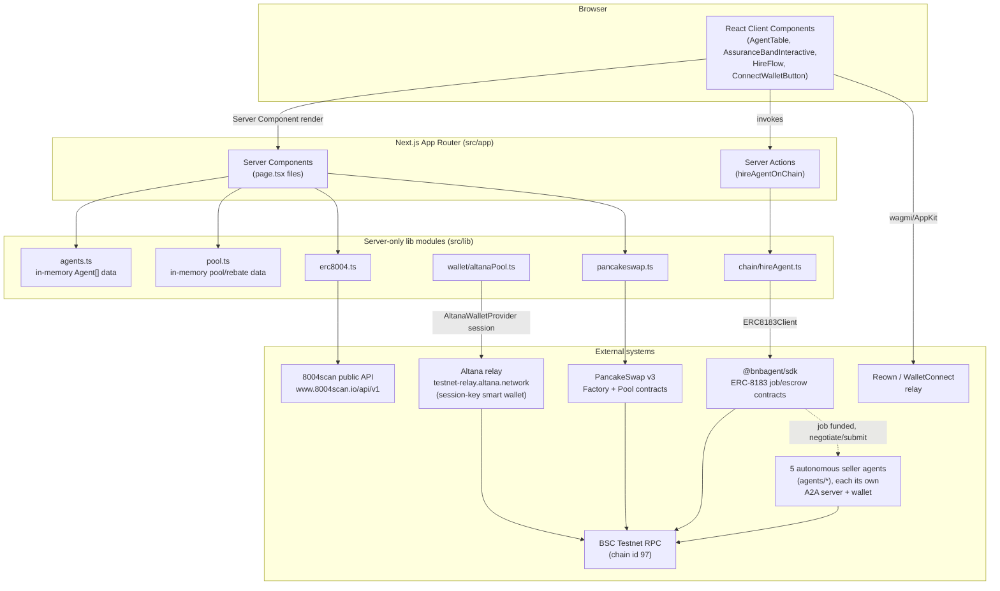
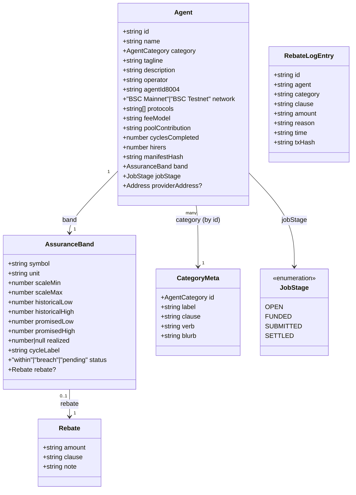
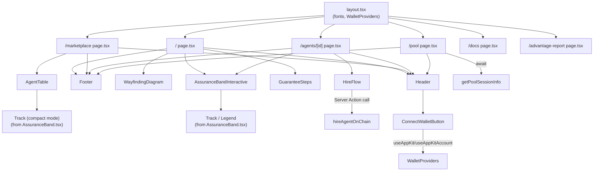
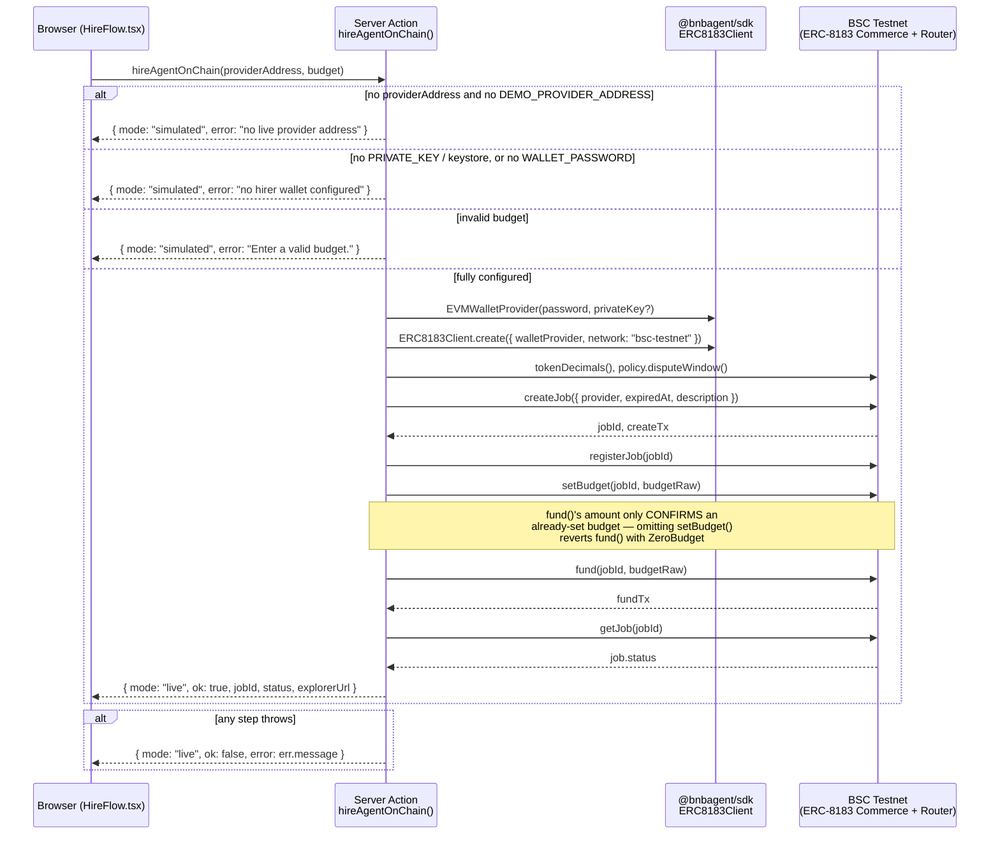
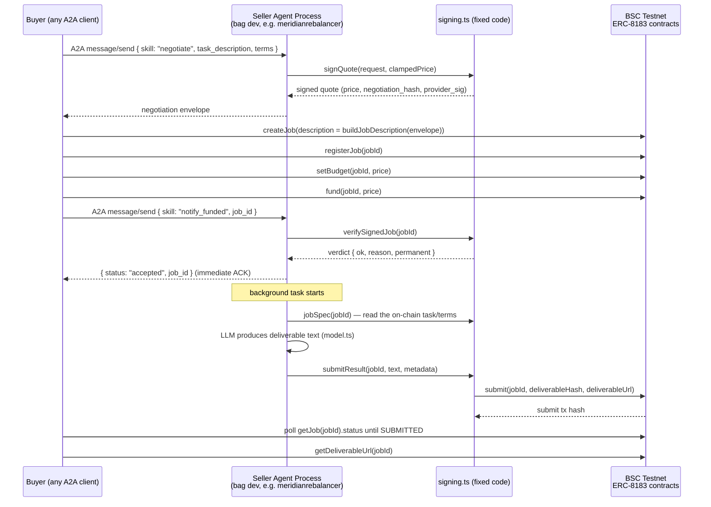
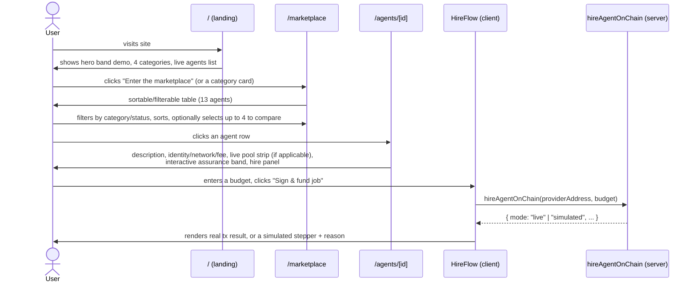
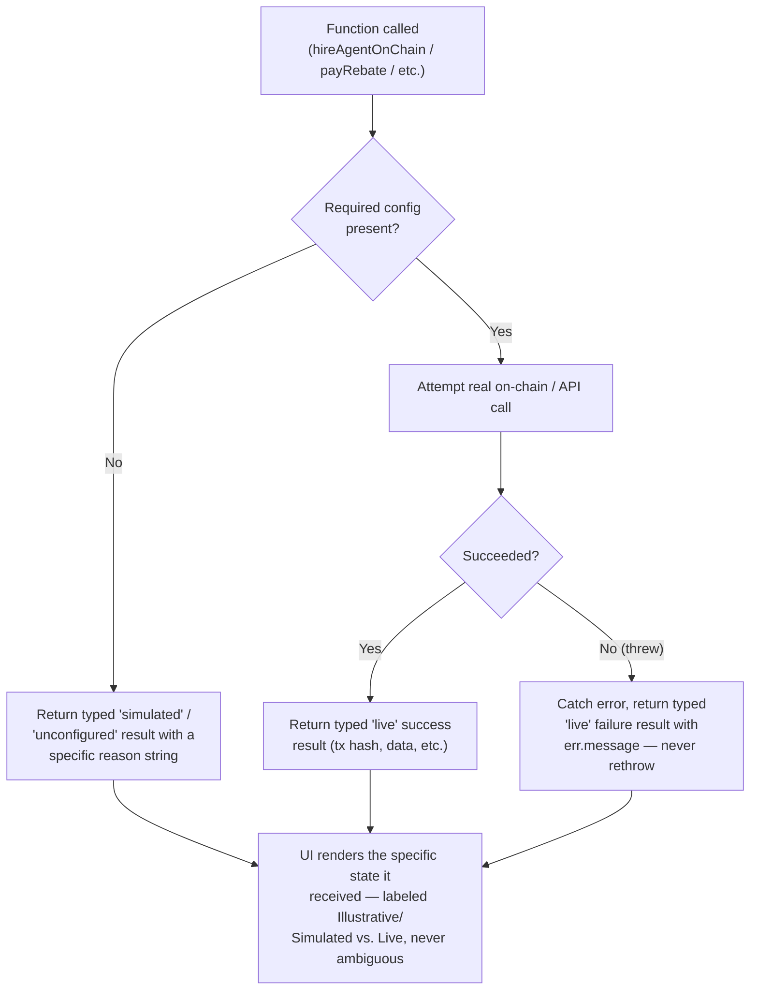

# Backstop — Official Technical Documentation

**Repository:** `linoxbt/Backstop` · **Branch documented:** `claude/website-ui-design-iirfsn` · **Status:** Active development (BNB Chain "Smart Money Era" hackathon submission)

This document is derived entirely from the current state of the codebase. Every claim below is backed by a specific file. Where the codebase does not yet implement something the product narrative describes, that gap is stated explicitly rather than glossed over — the codebase itself follows this same discipline (see [§16 Error Handling Strategy — the "honest gating" pattern](#16-error-handling-strategy--the-honest-gating-pattern)), and this document follows it too.

---

## Table of Contents

1. [Project Overview](#1-project-overview)
2. [Purpose and Vision](#2-purpose-and-vision)
3. [Core Features](#3-core-features)
4. [Architecture Overview](#4-architecture-overview)
5. [Technology Stack](#5-technology-stack)
6. [Folder and Project Structure](#6-folder-and-project-structure)
7. [The Data Model (in lieu of a database)](#7-the-data-model-in-lieu-of-a-database)
8. [How Each Major Module Works](#8-how-each-major-module-works)
9. [Frontend Architecture](#9-frontend-architecture)
10. [Backend Architecture](#10-backend-architecture)
11. [The Autonomous Agent Layer (`agents/`)](#11-the-autonomous-agent-layer-agents)
12. [External Integrations](#12-external-integrations)
13. [User Flows](#13-user-flows)
14. [Business Logic — The Assurance Band and Rebate Model](#14-business-logic--the-assurance-band-and-rebate-model)
15. [State Management](#15-state-management)
16. [Error Handling Strategy — the "honest gating" pattern](#16-error-handling-strategy--the-honest-gating-pattern)
17. [Authentication and Authorization](#17-authentication-and-authorization)
18. [Security Considerations](#18-security-considerations)
19. [Performance Optimizations](#19-performance-optimizations)
20. [Scalability Considerations](#20-scalability-considerations)
21. [Design System](#21-design-system)
22. [Important Design Decisions](#22-important-design-decisions)
23. [Current Limitations](#23-current-limitations)
24. [Future Improvement Opportunities](#24-future-improvement-opportunities)
25. [Glossary](#25-glossary)

---

## 1. Project Overview

**Backstop** is a Next.js web application that presents an **agent marketplace** for the BNB Smart Chain (BSC): a place to browse and hire autonomous on-chain trading/portfolio-management agents — liquidity rebalancers, grid traders, yield routers, and lending health-factor monitors.

The application has two structurally distinct parts in this repository:

1. **`src/`** — the Next.js 16 marketplace web app (App Router). This is the product surface: browsing agents, viewing an agent's performance guarantee, hiring an agent through a real on-chain job, and viewing the shared assurance pool that backs every guarantee.
2. **`agents/`** — five independent, self-contained agent projects (`meridianrebalancer`, `tidelinegrid`, `cordgrid`, `cisternyield`, `sentryhf`), each scaffolded by the third-party **BNB Agent Studio CLI** (`bag`). These are standalone Node/TypeScript services — separate npm/pnpm workspaces with their own `package.json`, wallet keystore, and A2A (Agent-to-Agent protocol) server — that implement the seller side of a real transaction: negotiating a price, accepting funded jobs, doing work, and submitting a deliverable on-chain. They are excluded from the main app's TypeScript project and ESLint config (`tsconfig.json` `exclude`, `eslint.config.mjs` `globalIgnores`) because each is its own independently-tooled project.

The marketplace's core promise is not "trust the agent's stated returns" — it is a verifiable, on-chain-enforced guarantee: every hire is measured against an **Assurance Band** (a historical range, a promised range, and — once a cycle settles — a realized outcome), and a shared **assurance pool**, funded by a cut of every agent's fees, automatically pays a capped rebate when an agent misses its promised floor.

## 2. Purpose and Vision

Derived from the product copy in `src/app/page.tsx`, `src/app/docs/page.tsx`, and `README.md`:

- **Problem framed by the product:** autonomous trading agents are typically marketed by self-reported performance numbers with no accountability if they underperform.
- **Backstop's answer:** every agent hire is a real on-chain job (ERC-8183). The band an agent is judged against is committed on-chain at hire time, so it cannot be moved after the fact. If the agent's realized outcome falls short of what it promised, a rebate is paid automatically from a pool that every agent contributes to via its fees — not something the hirer has to dispute or claim.
- **The three-step guarantee**, stated verbatim in `src/components/GuaranteeSteps.tsx`:
  1. "Hire funds an ERC-8183 job — the promised band commits on-chain."
  2. "Cycle settles — the agent's manifest hash is verified, not self-reported."
  3. "Miss the band → the pool pays a capped rebate. Automatically."
- **Honesty as a design constraint, not just a tone:** the codebase repeatedly gates real functionality behind live credentials/state and falls back to a clearly-labeled illustrative/simulated state rather than fabricating a result. This is visible in `hireAgentOnChain`, `payRebate`, `getPoolSessionInfo`, `lookupAgentByOwner`, and `getLivePoolState` (see [§16](#16-error-handling-strategy--the-honest-gating-pattern)).

## 3. Core Features

| Feature | What it does | Where it lives |
|---|---|---|
| Agent marketplace listing | Sortable, filterable table of all agents with a multi-select "compare" view | `src/components/AgentTable.tsx`, `src/app/marketplace/page.tsx` |
| Agent dossier page | Per-agent detail page: description, operator, on-chain identity, network, fee, live PancakeSwap pool data (when applicable), assurance band, hire panel | `src/app/agents/[id]/page.tsx` |
| Interactive assurance band | A visual "corridor" (historical range) + "band" (promised range) + a marker showing the realized outcome, with a "Settle cycle" trigger animation | `src/components/AssuranceBand.tsx`, `src/components/AssuranceBandInteractive.tsx` |
| Real on-chain hire flow | Executes the actual ERC-8183 `createJob → registerJob → setBudget → fund → getJob` sequence on BSC Testnet via `@bnbagent/sdk`, when credentials are configured; otherwise a labeled simulated stepper | `src/lib/chain/hireAgent.ts`, `src/components/HireFlow.tsx` |
| Assurance pool page | Reserve statistics, the pool's Altana session-key authority (live or illustrative), and a rebate payout ledger | `src/app/pool/page.tsx`, `src/lib/pool.ts`, `src/lib/wallet/altanaPool.ts` |
| Real ERC-8004 identity lookup | Looks up an agent's real on-chain identity registration (8004scan public index) and displays a verified/unregistered/illustrative badge accordingly | `src/lib/erc8004.ts` |
| Real PancakeSwap v3 pool read | Reads a live WBNB/USDT pool's current tick/price/liquidity directly from PancakeSwap v3's deployed BSC Testnet contracts | `src/lib/pancakeswap.ts` |
| Wallet connect | Reown AppKit (WalletConnect) + wagmi connect button, gracefully disabled when unconfigured | `src/components/ConnectWalletButton.tsx`, `src/components/WalletProviders.tsx`, `src/lib/wallet/config.ts` |
| Docs reference page | Static reference: the guarantee steps, hire lifecycle stages, category list, live agents, and the protocol stack table | `src/app/docs/page.tsx` |
| Agent Advantage Report | A template comparing "with agent" vs. "without agent" outcomes for three tasks, explicitly marked unpopulated | `src/app/advantage-report/page.tsx` |
| Assurance pool provisioning scripts | Admin-only CLI scripts to grant/register and revoke the pool's Altana session key | `scripts/provision-altana-pool.ts`, `scripts/revoke-altana-pool.ts` |
| Autonomous seller agents | Five standalone A2A servers that can negotiate a price, accept a funded ERC-8183 job, do LLM-driven work, and submit a deliverable on-chain | `agents/*/app/agent/src/*.ts` |
| Real, wallet-signed hire records | Connecting a wallet while hiring signs a real authorization message, verified server-side and stored in Supabase; a per-wallet "My Agents" page reads them back | `src/lib/chain/hires.ts`, `src/lib/chain/hireAuthMessage.ts`, `src/app/my-agents/page.tsx` |
| Automatic, real, per-hire rebate payouts | An authenticated cron endpoint, hit every 30 minutes, checks every real agent's actual assurance-band status and pays a real rebate — from the pool's Altana session, to the actual hirer's wallet — for every real hire against a breached agent that hasn't been rebated yet. `/pool`'s ledger shows these labeled "Real payout," distinct from the older illustrative log | `src/lib/chain/bandBreach.ts`, `src/lib/chain/autoRebate.ts`, `src/lib/chain/rebates.ts`, `src/app/api/cron/rebalance-check/route.ts`, `.github/workflows/rebalance-breach-check.yml` |

## 4. Architecture Overview

Backstop has no traditional multi-tier backend (no separate API server, no database). It is a **Next.js App Router application** where:

- **Server Components** (the default for every page under `src/app/`) fetch data at render time — either from an in-memory TypeScript data module (`src/lib/agents.ts`, `src/lib/pool.ts`) or from live external reads (BSC Testnet RPC, the 8004scan public API).
- **Server Actions** (`"use server"` functions) handle the one piece of real state-changing logic exposed to the browser: submitting a hire, which is a client-invoked function that runs exclusively on the server and touches the blockchain directly via `@bnbagent/sdk`.
- **Client Components** (`"use client"`) are used only where interactivity is required: the sortable/filterable agent table, the interactive assurance band, the hire flow stepper, and the wallet-connect button.



**Not shown in the diagram above (added after it was drawn):** a Supabase Postgres
database now backs two real, server-only write paths — wallet-signed hire records
(`src/lib/chain/hires.ts`) and real rebate payouts (`src/lib/chain/rebates.ts`,
`autoRebate.ts`) — both read publicly (for `/my-agents` and `/pool`) but writable only
through a service-role client, never the public client. A GitHub Actions cron job hits
`src/app/api/cron/rebalance-check/route.ts` every 30 minutes, which is the actual
trigger for `autoRebate.ts`'s real, per-hire Altana payouts. See §12.7 and §14.

**Key architectural fact:** the marketplace app and the five agent projects under `agents/` are **not wired together programmatically**. The marketplace reads each real agent's on-chain `providerAddress` from `src/lib/agents.ts` and can create/fund an ERC-8183 job addressed to that agent; the agent, running as its own separate process (`bag dev`), independently watches the chain and reacts. The only coupling is the shared BSC Testnet chain state and the ERC-8183 contracts both sides call into — there is no direct API call between the two codebases.

## 5. Technology Stack

Derived from `package.json`, `agents/*/app/agent/package.json`, `next.config.ts`, and `tsconfig.json`.

### Marketplace app (`src/`)

| Layer | Technology | Version (from `package.json`) |
|---|---|---|
| Framework | Next.js (App Router, Turbopack) | `16.3.2` |
| UI library | React / React DOM | `19.2.8` |
| Language | TypeScript | `^5` |
| Styling | Tailwind CSS v4 (`@theme inline` token system) | `^4` |
| Fonts | `next/font/google` — Space Grotesk (display), Outfit (body/UI), DM Mono (data) | n/a |
| Blockchain client | `viem` | `^2.55.19` |
| ERC-8183 / Altana SDK | `@bnbagent/sdk` | `^0.5.3` |
| Altana account-abstraction SDK | `@altananetwork/sdk` (peer dependency of `@bnbagent/sdk`) | `^0.7.1` |
| Wallet connect | `@reown/appkit`, `@reown/appkit-adapter-wagmi`, `wagmi` | `^1.8.23` / `^1.8.23` / `^3.7.6` |
| Data fetching (wallet UI) | `@tanstack/react-query` | `^5.102.3` |
| Server-only guard | `server-only` | `^0.0.1` |
| Real hire/rebate persistence | `@supabase/supabase-js` | `^2.112.4` |
| Testing | Vitest | `^4.1.11` |
| Linting | ESLint (`eslint-config-next`) | `^9` |
| Deployment | Netlify (`@netlify/plugin-nextjs`, `netlify.toml`) | Node 20 |

### Autonomous agent projects (`agents/*/app/agent`)

Each of the five agents is its own pnpm workspace scaffolded by `@bnbagent/studio-cli` ("`bag`"). Verified from `agents/meridianrebalancer/app/agent/src/*.ts` and `studio.toml`:

| Layer | Technology |
|---|---|
| Protocol surface | `@a2a-js/sdk` (Agent-to-Agent protocol — JSON-RPC over HTTP, served at `/.well-known/agent-card.json` + `message/send`) |
| Runtime helpers | `@bnbagent/studio-runtime` (wallet resolution, ERC-8183 workflow helpers, Pieverse LLM credit management, chain read tools) |
| LLM SDK | Vercel `ai` SDK (`tool`, `wrapLanguageModel`, `LanguageModelMiddleware`) with Zod schemas for tool inputs |
| LLM provider | Pieverse LLM (`pieverse-llm`, model `auto/free` by default — zero-deposit) |
| Wallet | Local encrypted EVM keystore (`kind = "evm-local"`), stored at the workspace root (`.studio/wallets/`) outside the deploy artifact |
| Target runtime | AWS Bedrock AgentCore (`runtime = "agentcore"` in `studio.toml`) |
| Deploy target | BNB Chain managed platform (`bag deploy --provider bnb`, a 48-hour testnet trial) — or `aws`/`azure` |

### Why some packages are explicitly excluded

`next.config.ts` aliases `@base-org/account` to an empty stub module (`src/lib/empty-module.ts`). The comment in the file explains why: `@wagmi/connectors`' Base Account connector pulls in Coinbase's CDP SDK and an x402 payment module tree that isn't fully published in a way Turbopack can statically resolve, and the app is BSC-only and doesn't need that connector.

## 6. Folder and Project Structure

```
Backstop/
├── src/
│   ├── app/                          Next.js App Router routes
│   │   ├── layout.tsx                 Root layout — fonts, metadata, WalletProviders
│   │   ├── globals.css                Tailwind v4 theme tokens + custom animations
│   │   ├── page.tsx                   Landing page (marketplace home)
│   │   ├── marketplace/page.tsx       Full agent table (category-filterable via ?category=)
│   │   ├── agents/[id]/
│   │   │   ├── page.tsx               Agent dossier (band, hire panel, live on-chain data)
│   │   │   └── loading.tsx            Skeleton loading state
│   │   ├── pool/page.tsx              Assurance pool page
│   │   ├── my-agents/page.tsx         Real, wallet-signed hire records + rebate status
│   │   ├── docs/page.tsx              Static reference/docs page
│   │   ├── advantage-report/page.tsx  TermiX "Agent Advantage Report" template
│   │   └── api/cron/rebalance-check/  Authenticated endpoint the auto-rebate cron hits
│   ├── components/                    Reusable React components (see §9)
│   └── lib/                           Server-only and shared logic (see §8)
│       ├── types.ts                    Core TypeScript types (Agent, AssuranceBand, ...)
│       ├── agents.ts                   The 13-agent in-memory data set
│       ├── pool.ts                     Assurance pool mock stats + rebate log
│       ├── band.ts                     bandPct() — the one shared band-math helper
│       ├── budget.ts                   Exact decimal budget parsing (no float precision loss)
│       ├── rateLimit.ts                In-memory + Postgres-backed rate limiting
│       ├── supabase.ts                 Publishable (read) + service-role (write) clients
│       ├── empty-module.ts             Stub for the aliased @base-org/account
│       ├── chain/hireAgent.ts          Server Action: real ERC-8183 hire flow
│       ├── chain/hires.ts              Server Action: wallet-signed hire records + rebate linkage
│       ├── chain/hireAuthMessage.ts    The message a hirer's wallet signs to authorize a record
│       ├── chain/bandBreach.ts         Real payout trigger: which real agents missed their band
│       ├── chain/rebalanceBreach.ts    Honest, separate PancakeSwap-liquidity signal (informational only)
│       ├── chain/autoRebate.ts         Pays a real, per-hire rebate for every breached agent's hires
│       ├── chain/rebates.ts            Reads the real rebate ledger for /pool
│       ├── wallet/
│       │   ├── config.ts               Reown/wagmi client configuration
│       │   └── altanaPool.ts           Assurance pool's Altana session payout logic
│       ├── erc8004.ts                  Real ERC-8004 identity lookup (8004scan API)
│       └── pancakeswap.ts              Real PancakeSwap v3 pool state reads
├── scripts/
│   ├── provision-altana-pool.ts       One-time: grant + register the pool's Altana session
│   └── revoke-altana-pool.ts          Admin-only: revoke that session immediately
├── supabase/migrations/                hires/rebates tables, RLS policies, rate_limits fn (§12.7)
├── .github/workflows/                  rebalance-breach-check.yml — the real auto-rebate cron trigger
├── agents/                             Five independent BNB Agent Studio projects (see §11)
│   ├── meridianrebalancer/
│   ├── tidelinegrid/
│   ├── cordgrid/
│   ├── cisternyield/
│   └── sentryhf/
├── public/                             Static assets (SVG icons)
├── .env.example                        Documented environment variables (no secrets)
├── next.config.ts                      Turbopack alias for @base-org/account
├── netlify.toml                        Netlify build configuration
├── eslint.config.mjs                   ESLint config (excludes agents/**)
├── tsconfig.json                       TypeScript config (excludes agents/**)
└── package.json
```

Each agent project under `agents/<name>/` follows this internal shape (verified on `meridianrebalancer`; the other four are structurally identical, generated by the same `bag init` scaffold):

```
agents/meridianrebalancer/
├── app/agent/
│   ├── src/
│   │   ├── unifiedMain.ts        Entrypoint — serves A2A on :9000 (+ a secondary port)
│   │   ├── sellerCore.ts         Protocol-neutral seller logic (negotiate, notifyFunded, sweep)
│   │   ├── executor.ts           A2A wire adapter over SellerCore
│   │   ├── signing.ts            ALL on-chain writes — fixed code, never LLM-callable
│   │   ├── agentCard.ts          Builds the discoverable AgentCard (+ OAuth2 scheme)
│   │   ├── tools.ts              Read-only chain tools exposed to the LLM
│   │   └── model.ts              AI SDK model factory (Pieverse credit-ensure middleware)
│   ├── studio.toml               Per-agent configuration (wallet, LLM, pricing, network)
│   └── package.json
├── .studio/
│   ├── wallets/                  Encrypted keystore (workspace root — never bundled into deploys)
│   └── .env.local                WALLET_PASSWORD, PIEVERSE_LLM_API_KEY (gitignored)
├── agentcore/                    AWS Bedrock AgentCore deploy descriptors
└── AGENTS.md / README.md         Scaffold-specific operating instructions
```

## 7. The Data Model (in lieu of a database)

**There is no database in this application.** All product data — the 13 listed agents, the four categories, the assurance pool's headline statistics, and the rebate payout ledger — is defined as static, typed, in-memory TypeScript data in `src/lib/agents.ts` and `src/lib/pool.ts`. Nothing is fetched from or written to a persistence layer at runtime for this data; it is compiled directly into the application.

The one exception is the small set of *live, read-only* values sourced from external systems at request time (an agent's ERC-8004 registration, a PancakeSwap pool's current tick, the Altana pool session's configuration) — these are described in [§12](#12-external-integrations), not stored anywhere.

Since there is no relational schema, the type relationships below (from `src/lib/types.ts`) are presented as the closest equivalent to an entity-relationship diagram:



**Notable fields:**

- `Agent.providerAddress` (optional, `0x`-prefixed): the discriminator between a **real** agent — one of the five deployed via BNB Agent Studio, backed by a real funded wallet — and an **illustrative** agent used to fill out the marketplace's four categories. Every place in the UI that shows live on-chain data (identity lookup, live address link, PancakeSwap pool strip) is gated on this field being present. Five of the thirteen agents in `AGENTS` have it set: `meridian-rebalancer`, `tideline-grid`, `cordgrid`, `cistern-yield`, `sentry-hf`.
- `AssuranceBand.status`: `"pending"` is used for an agent with no settled cycle yet (`realized: null`) — currently only `estuary-grid`. `"within"` and `"breach"` distinguish whether the realized value landed inside `[promisedLow, promisedHigh]`.
- `AssuranceBand.rebate` is present only when `status === "breach"`.

## 8. How Each Major Module Works

### `src/lib/types.ts`
Defines every shared TypeScript type in the app: `AgentCategory`, `CategoryMeta`, `JobStage`, `AssuranceBand`, and `Agent`. No logic — pure type definitions. Every other module in `src/lib` and every component that touches agent data imports from here.

### `src/lib/agents.ts`
- **What it does:** exports `CATEGORIES` (the four category definitions) and `AGENTS` (the 13-agent array), plus three lookup helpers: `getAgent(id)`, `agentsByCategory(category)`, `categoryMeta(category)`.
- **Why it exists:** the single source of truth for all agent listing data across every page.
- **How it works internally:** a flat, hand-written array literal. No fetching, no caching layer — it's evaluated once at module load (effectively build time, since these pages are statically generated) and referenced by identity everywhere else.
- **Interacts with:** every page component (`page.tsx`, `marketplace/page.tsx`, `agents/[id]/page.tsx`, `docs/page.tsx`) and `WayfindingDiagram.tsx`.

### `src/lib/pool.ts`
- **What it does:** exports `POOL` (the pool's headline stats: TVL, payout ratio, solvency buffer, total rebates, and an illustrative session-authority object) and `REBATE_LOG` (five hand-written recent-payout entries).
- **Why it exists:** backs `/pool`'s stats section and rebate ledger.
- **How it works internally:** static data, same pattern as `agents.ts`. The `session` sub-object here is explicitly the **illustrative fallback** used when the real Altana session (`ALTANA_SESSION` env var) is not configured — see `getPoolSessionInfo()` in `altanaPool.ts`.

### `src/lib/band.ts`
- **What it does:** exports a single function, `bandPct(band, value)`, which maps a raw value onto a 0–100 percentage position along the band's `[scaleMin, scaleMax]` axis, clamped to `[0, 100]`.
- **Why it exists:** every visual position in the assurance-band UI (the historical corridor, the promised band, the realized marker) is computed from this one function, so the math is defined exactly once.
- **Used by:** `AssuranceBand.tsx`, `AssuranceBandInteractive.tsx`, `AgentTable.tsx` (in the compare-mode mini-bands).

### `src/lib/chain/hireAgent.ts`
See [§10 Backend Architecture](#10-backend-architecture) — this is one of the app's Server Actions.

### `src/lib/budget.ts`
- **What it does:** `parseBudgetToRaw(budgetHuman, decimals)` — strips thousands
  separators/whitespace, validates finiteness/positivity, then converts to raw token
  units with viem's `parseUnits` (exact string-based decimal math).
- **Why it exists:** a real bug fix, not a refactor for its own sake — the previous
  inline `Math.round(budget * 10**decimals)` lost precision on realistic 18-decimal
  budgets (e.g. `2500.33` produced `2500329999999999934464`, not `2500330000000000000000`).
  Covered by `budget.test.ts`.
- **Used by:** `hireAgent.ts`, twice — a preflight check at a hardcoded 18 decimals
  before any network call, then re-parsed against the real on-chain `decimals` once the
  ERC-8183 client resolves it, rather than trusting the preflight value for the actual
  transaction.

### `src/lib/rateLimit.ts`
- **What it does:** `checkRateLimit(key, windowSeconds)` — a process-local, in-memory
  one-call-per-window guard. `checkRateLimitPersistent(key, windowSeconds)` — the same
  contract, backed by a Postgres RPC function (`check_rate_limit`, see §12.7) when
  Supabase is configured, so it actually coordinates across serverless instances and
  survives a cold start; falls back to the in-memory version otherwise or on a database
  error.
- **Used by:** `hireAgent.ts` (the persistent variant, keyed on caller IP — see §18).

### `src/lib/supabase.ts`
- **What it does:** exports two Supabase clients — `supabase` (publishable key,
  read-only in practice) and `supabaseAdmin` (service-role key, bypasses Row Level
  Security). Guarded with `import "server-only"`.
- **Why two clients:** `hires`/`rebates` have a public-read RLS policy but no public
  insert policy — only `supabaseAdmin` can write a row. This is what makes the write
  path un-forgeable by anyone holding just the (deliberately public) publishable key;
  see §18.

### `src/lib/chain/hires.ts`
- **What it does:** `recordHire()` — verifies a wallet's signature over a hire
  authorization message (`viem.verifyMessage`) and its embedded timestamp's freshness
  (rejects anything older than 5 minutes, guarding against a replayed signed message),
  then inserts via `supabaseAdmin`. `getHiresForWallet()` — public read, enriched with
  each hire's real rebate status via a `rebates` embed. `getUnrebatedHiresForAgent()` /
  `recordRebate()` — the query and write `autoRebate.ts` uses to pay and record a real,
  per-hire rebate exactly once.
- **Marked `"use server"`:** every export here is a Next.js Server Action, callable
  directly from a client component (`my-agents/page.tsx` calls `getHiresForWallet`
  this way) without a hand-written API route.

### `src/lib/chain/hireAuthMessage.ts`
- **What it does:** `buildHireAuthMessage()` — pure string builder for the message a
  connected wallet signs to authorize a hire record, including an ISO 8601 timestamp
  that `hires.ts`'s `recordHire()` later checks for staleness.

### `src/lib/chain/bandBreach.ts`
- **What it does:** `checkAgentBandBreaches()` — the real payout trigger. For every
  agent with a real `providerAddress`, checks whether its (static, illustrative)
  `AssuranceBand.status` is `"breach"`. This reuses the exact signal `/pool`'s "clean
  entries" list and `AssuranceBandInteractive` already treat as ground truth elsewhere
  in the UI, rather than an unrelated proxy condition.
- **Known caveat, stated in the module's own doc comment:** `band.status` is still
  static data, not a live measurement of an agent's actual execution — see §14 and §23.

### `src/lib/chain/rebalanceBreach.ts`
- **What it does:** `checkRebalancerBreach()` — an honest, separate, *informational*
  signal: whether a live PancakeSwap v3 WBNB/USDT pool with real liquidity currently
  exists. This used to be the auto-rebate trigger; it no longer decides who gets paid
  (see `bandBreach.ts` above) but is still shown on `/pool` as "Clause 0(b)" since it's
  a real, honestly-checkable fact in its own right.

### `src/lib/chain/autoRebate.ts`
- **What it does:** `runAutoRebateCheck()` — calls `checkAgentBandBreaches()`; for every
  breached real agent, calls `getUnrebatedHiresForAgent()` and, for each unrebated hire
  found, pays that hire's own wallet a real rebate via `payRebate()` and records it via
  `recordRebate()`. Returns which hires were paid and which agents/hires were skipped
  (and why — e.g. "no real hires to rebate for this agent yet").
- **Idempotency:** the `rebates.hire_id` unique database constraint, not a timer — a
  given hire can never be rebated twice, even across a cold start. Called only from the
  authenticated cron route handler (§10, §18), never from a page render.

### `src/lib/chain/rebates.ts`
- **What it does:** `getRecentRebates()` — public, read-only query against the real
  `rebates` table, used by `/pool` to render actual payouts (labeled "Real payout")
  alongside the older static `REBATE_LOG`.

### `src/lib/wallet/altanaPool.ts`, `src/lib/erc8004.ts`, `src/lib/pancakeswap.ts`
See [§12 External Integrations](#12-external-integrations) — these are the three server-only modules that perform real, live external reads/writes, each independently gated.

### `src/lib/wallet/config.ts`
- **What it does:** builds the Reown AppKit / wagmi configuration: `projectId` (from `NEXT_PUBLIC_REOWN_PROJECT_ID`), `networks` (BSC Testnet + BSC Mainnet, from `@reown/appkit/networks`), a `WagmiAdapter` with cookie-based SSR storage, and `appKitMetadata` (app name/description/url/icon for the wallet-connect modal).
- **Why it exists:** centralizes wallet-connect configuration so `WalletProviders.tsx` and `ConnectWalletButton.tsx` don't duplicate it.
- **How it works internally:** `projectId` defaults to an empty string when the env var is unset — every consumer checks for that empty string to decide whether to render a live or disabled UI.

### `scripts/provision-altana-pool.ts` / `scripts/revoke-altana-pool.ts`
- **What they do:** one-off, operator-run Node scripts (`npx tsx scripts/...`) — not part of the request/response path of the running app.
- **`provision-altana-pool.ts`:** reads `ALTANA_ADMIN_PRIVATE_KEY`, constructs an `AltanaWalletProvider` in admin mode, and calls `grantSession()` with permissions scoped to exactly one call (`transfer(address,uint256)` on the ERC-8183 payment token) and a daily spend cap (`ALTANA_POOL_DAILY_CAP`). With `register: true` (the default), it also registers the session's public key in the Altana Keystore registry, at a real on-chain fee (~$0.50 in native BNB from the admin wallet). It prints the resulting serialized `ALTANA_SESSION` value for the operator to place in `.env.local` / hosting provider env vars.
- **`revoke-altana-pool.ts`:** the inverse — reads `ALTANA_ADMIN_PRIVATE_KEY` and `ALTANA_SESSION`, and calls `revokeSession()`, which invalidates the session immediately at the on-chain validator.
- **Why a script and not a UI button:** the file's own comment states the reasoning — this app has no authentication layer, so a revoke control reachable by any visitor would be a denial-of-service vector against the pool's own payout path. Provisioning and revocation are deliberately operator-only, off the web surface entirely.
- **Why two separate keys (admin vs. session):** so that the day-to-day payout path (the session key, used by `payRebate()`) never has access to the higher-privilege admin key. A leaked session key is bounded by its own spend cap and expiry; the admin key is only ever used interactively by the operator.

## 9. Frontend Architecture

The frontend is React 19 running inside Next.js 16's App Router, styled with Tailwind CSS v4. There is no client-side routing library beyond Next's own `<Link>`/`next/navigation`, no global state manager (Redux/Zustand/etc.), and no client-side data-fetching library beyond `@tanstack/react-query` (which is used exclusively for wagmi/AppKit's internal wallet-connection state, not for product data).

### Component inventory (`src/components/`)

| Component | Client/Server | Responsibility |
|---|---|---|
| `Header.tsx` | Client (`usePathname` for active nav state) | Site header: logo, nav links, `ConnectWalletButton` |
| `Footer.tsx` | Server | Site footer: logo, nav links, "BSC Testnet" label |
| `Logo.tsx` | Server | `Seal` (the circular wedge-marker mark) and `Wordmark` |
| `AgentTable.tsx` | Client | Sortable/filterable table of all agents, with a checkbox-driven multi-agent band comparison panel (max 4) |
| `AssuranceBand.tsx` | Server | The visual band primitives: `Track` (the corridor/band/marker SVG-free div layout) and `Legend`, both re-exported and reused directly by `AssuranceBandInteractive.tsx` and `AgentTable.tsx`'s compare panel |
| `AssuranceBandInteractive.tsx` | Client | Wraps `Track`/`Legend` with a "Settle cycle" button that animates the marker from the mid-band resting position to its realized position, then reveals a rebate stamp or a "closed clean" message |
| `HireFlow.tsx` | Client | The hire panel on an agent's dossier page — invokes the `hireAgentOnChain` Server Action and renders either the real on-chain result or a simulated stepper |
| `GuaranteeSteps.tsx` | Server | The three-step guarantee list, reused on the landing page and `/docs` |
| `WayfindingDiagram.tsx` | Server | The four-category grid with a floating "Reserve" pill/card linking to `/pool` |
| `ConnectWalletButton.tsx` | Client (`useAppKit`, `useAppKitAccount`) | Wallet-connect trigger; renders disabled when `projectId` is unset |
| `WalletProviders.tsx` | Client | Top-level provider tree: calls `createAppKit()` once (only if `projectId` is set) and wraps children in `WagmiProvider` + `QueryClientProvider` |

### Route inventory (`src/app/`)

| Route | Rendering mode | Purpose |
|---|---|---|
| `/` | Static | Landing page — hero with a live band demo, four-category wayfinding diagram, guarantee steps, list of live (real) agents linked to BscScan, pool stat strip, closing CTA |
| `/marketplace` | Dynamic (reads `searchParams.category`) | Full sortable/filterable agent table |
| `/agents/[id]` | Static (`generateStaticParams` over all 13 agent ids), async Server Component | Agent dossier: identity, network, fee, live PancakeSwap strip (conditional), assurance band, hire panel |
| `/agents/[id]` (loading) | — | Skeleton UI shown while the async dossier page resolves its live data fetches |
| `/pool` | Static, async Server Component | Reserve stats, session authority card (live or illustrative), liquidity check, real band-breach payout check, real + illustrative rebate ledger |
| `/my-agents` | Client Component | Real, wallet-signed hire records for the connected wallet, each showing real rebate status when one exists |
| `/docs` | Static | Guarantee steps, hire lifecycle stage list, category list, live agents, protocol stack table |
| `/advantage-report` | Static | TermiX Agent Advantage Report template (explicitly unpopulated) |

### Component relationship diagram



## 10. Backend Architecture

There is no standalone backend server or REST/GraphQL API in this project. "Backend" logic exists purely as:

1. **Next.js Server Components** — `async function Page()` functions that run only on the server, fetch data (from static modules or live external sources), and render HTML. Used by `agents/[id]/page.tsx`, `pool/page.tsx`, and `marketplace/page.tsx`.
2. **Next.js Server Actions** — every export of `src/lib/chain/hireAgent.ts` and `src/lib/chain/hires.ts` (both marked `"use server"`). `hireAgentOnChain` performs the real state-changing on-chain operation (submitting the ERC-8183 job); `recordHire` performs the real state-changing database write (a signature-verified hire record); `getHiresForWallet`, `getUnrebatedHiresForAgent`, and `recordRebate` are the reads/writes the auto-rebate path and `/my-agents` use. Next.js compiles each into a callable endpoint automatically; there is no hand-written route handler for any of them.
3. **One hand-written route handler** — `src/app/api/cron/rebalance-check/route.ts`, a `GET` handler (not a Server Action, since it's invoked by an external cron job, not client-side React) protected by a timing-safe bearer-token check against `CRON_SECRET`. See §18.
4. **Server-only utility modules** — `src/lib/erc8004.ts`, `src/lib/pancakeswap.ts`, `src/lib/wallet/altanaPool.ts`, `src/lib/supabase.ts`, `src/lib/rateLimit.ts`, `src/lib/chain/bandBreach.ts`, `src/lib/chain/rebalanceBreach.ts`, and `src/lib/chain/autoRebate.ts` are marked with the `server-only` package's import guard (`import "server-only"`), which throws a build-time/runtime error if accidentally imported into client-bundled code.

### The hire flow — `hireAgentOnChain`

This is the most important piece of backend logic in the app. Full source is in `src/lib/chain/hireAgent.ts`; the sequence it executes:



`HireFlow.tsx` (client) branches on the response's `mode`:
- **`"live"`** — renders the real job id, status, and a BscScan Testnet transaction link (success), or the raw error string (failure). No further animation.
- **`"simulated"`** — plays a two-step illustrative stepper ("Job opened" → "Funded — manifest hash locked") with `window.setTimeout` delays, then shows the same manifest hash from the agent's static data and the reason it fell back to simulation, printed verbatim from `result.error`.

### Required environment for the live path

From `.env.example` (no values shown — only variable names and their purpose, matching the repository's own no-secrets policy):

| Variable | Purpose |
|---|---|
| `PRIVATE_KEY` | The hirer's wallet private key (only needed on first run — imported into an encrypted local keystore under `WALLET_PASSWORD` thereafter) |
| `WALLET_PASSWORD` | Password to encrypt/decrypt the hirer wallet keystore |
| `DEMO_PROVIDER_ADDRESS` | Optional fallback provider address for agents without a real `providerAddress`, to smoke-test the on-chain path |
| `NEXT_PUBLIC_REOWN_PROJECT_ID` | Enables the wallet-connect button (Reown AppKit) |
| `ALTANA_ADMIN_PRIVATE_KEY` | The assurance pool's admin key — used only by the provisioning/revoke scripts, never by the running app |
| `ALTANA_SESSION` | The serialized, already-granted session the running app uses to (attempt to) pay rebates and to render `/pool`'s live session card |
| `ALTANA_POOL_DAILY_CAP` | Daily spend cap (in payment-token base units) enforced when provisioning the session |

## 11. The Autonomous Agent Layer (`agents/`)

Each of the five projects under `agents/` (`meridianrebalancer`, `tidelinegrid`, `cordgrid`, `cisternyield`, `sentryhf`) is a standalone **ERC-8183 seller agent** scaffolded by the BNB Agent Studio CLI. They implement the *other side* of the transaction the marketplace app initiates: once a hirer's job is funded on-chain, one of these processes (if running) is what actually negotiates, delivers, and gets paid.

### Structure of one agent (`meridianrebalancer`, representative of all five)

- **`src/unifiedMain.ts`** — the process entrypoint. Serves an A2A JSON-RPC server (agent card at `/.well-known/agent-card.json`, `message/send` on port 9000) plus a secondary "Foundry invocations" surface on port 8088. Run locally with `bag dev` (in-process `tsx`, no Docker).
- **`src/agentCard.ts`** — builds the discoverable `AgentCard`: it advertises exactly two skills, `negotiate` and `notify_funded`, and (when deployed with Cognito configured) an OAuth2 client-credentials security scheme. Locally, with no Cognito env vars, the card omits the scheme entirely, so `bag dev` is reachable anonymously for local testing.
- **`src/sellerCore.ts`** — the protocol-neutral core logic (imports nothing from the A2A SDK, so it could back any transport):
  - `negotiate(data)` — reads the fixed list price from `studio.toml`, clamps it to `[min_price, max_price]`, and returns an EIP-191-signed quote envelope (price, currency, negotiation hash, provider signature). Pricing is rule-based; the LLM is never in this path.
  - `notifyFunded(data)` — the buyer's "I funded job X" notification. Verifies the funded job on-chain (a couple of `eth_call`s) and ACKs `accepted`/`rejected` immediately; the actual delivery (LLM work + on-chain `submit`) runs in a background task so the caller isn't blocked. A background "sweep" also checks for any other funded jobs assigned to this provider that never got an explicit `notify_funded` call.
  - Background delivery has a hard timeout (`NOTIFY_DELIVERY_TIMEOUT_SECONDS`, default 600s) so a hung RPC call can't pin the process busy indefinitely; a timeout is treated as transient and retried by a later sweep, not dropped.
- **`src/executor.ts`** — the thin A2A wire adapter: dispatches an inbound `{"skill": "negotiate"|"notify_funded", ...}` DataPart to the matching `SellerCore` method and wraps the result back into an A2A message.
- **`src/signing.ts`** — **every on-chain write** the agent performs. This is fixed, non-LLM-callable code: `signQuote`, `verifySignedJob`, `submitResult` (builds the deliverable manifest, uploads it to storage, calls the on-chain `submit`), and `settle` (claims payment after the dispute window). The file's own doc comment states the invariant explicitly: signing is never exposed as an LLM tool.
- **`src/tools.ts`** — the **read-only** chain tools exposed to the LLM (via the Vercel AI SDK's `tool()` wrapper): wallet info, native/`U`-token balances, network info, transaction status, ERC-8004 identity lookups, and ERC-8183 job status/listing. None of these can mutate chain state.
- **`src/model.ts`** — builds the AI SDK `LanguageModel` for the configured `[llm]` provider. For the default provider, Pieverse LLM, it wraps the model with a credit-ensure middleware that tops up the agent's LLM credit balance from its Pieverse account balance before each generate/stream call — gated by `[llm.auto_renew]` in `studio.toml` and never itself an LLM-callable tool.
- **`studio.toml`** — per-agent configuration: wallet kind/keystore path/address, LLM provider and pricing, `[payments.erc8183]` (currency, price, min/max clamp, quote TTL), `[storage]` (local file storage by default — does not survive a redeploy), and `[deploy]` target.

### Agent-side sequence: negotiate → fund → deliver



### Deployment model

`AGENTS.md` in each scaffold documents two run modes:
- **Local:** `bag dev` — runs the A2A server in-process via `tsx`, no Docker, reachable at `http://localhost:9000`.
- **Managed platform (48-hour testnet trial):** `bag platform login` (GitHub device-flow authentication) followed by `bag deploy --provider bnb`. The platform injects the agent's secrets into its own Secrets Manager and routes requests to the agent's native A2A surface; the trial is testnet-forced and auto-reclaimed after 48 hours.

**As of the current repository state**, none of the five agents has an active managed-platform deployment or a persistent always-on process — they are runnable, verified-correct scaffolds with real funded wallets, but the marketplace app's live agent addresses do not currently have a 24/7 listener behind them unless an operator has `bag dev` running.

## 12. External Integrations

Every external integration in this codebase follows the same pattern: **attempt the real operation if configuration/credentials exist; otherwise return a typed "not configured" or "illustrative" result rather than throwing or fabricating data.** This section documents each one; the shared pattern itself is detailed in [§16](#16-error-handling-strategy--the-honest-gating-pattern).

### 12.1 `@bnbagent/sdk` — ERC-8183 job/escrow protocol

- **Used by:** `src/lib/chain/hireAgent.ts` (client-side of a hire), every `agents/*/app/agent/src/signing.ts` (seller-side).
- **What it provides:** `ERC8183Client` (a facade over the on-chain Commerce, Router, and Policy contracts), `EVMWalletProvider` (local encrypted-keystore wallet), `JobStatus` enum.
- **Network:** BSC Testnet (chain id 97). No contracts are deployed by this repository — `@bnbagent/sdk` targets contracts the SDK's maintainers have already deployed.
- **Verified real-world interaction pattern:** `createJob → registerJob → setBudget → fund` (see [§10](#10-backend-architecture)). The `setBudget` step was found to be *required* — omitting it causes `fund()` to revert with `ZeroBudget`, because `fund()`'s amount argument is only a confirmation against an already-set budget, not an assignment. This is documented directly in a code comment in `hireAgent.ts`.

### 12.2 `@bnbagent/sdk/wallets` (`AltanaWalletProvider`) — the assurance pool's payout authority

- **Used by:** `src/lib/wallet/altanaPool.ts`, `scripts/provision-altana-pool.ts`, `scripts/revoke-altana-pool.ts`.
- **What it provides:** account-abstraction session keys on top of Altana's smart-wallet infrastructure. An **admin** key can `grantSession()` — authorizing a separate **session** key, scoped to an explicit permission set (in this app: only `transfer(address,uint256)` on the ERC-8183 payment token, capped at a daily spend limit) and an expiry.
- **How the running app uses it:** `payRebate(to, amountRaw, note)` in `altanaPool.ts` loads the already-granted session from the `ALTANA_SESSION` env var (`AltanaWalletProvider.sessionFromEnv`) and calls `makeExecutor({ client }).execute({...})` to perform the ERC-20 transfer. The admin key is never touched by the running app — only by the two operator scripts.
- **`getPoolSessionInfo()`:** a separate, purely read-only function that parses `ALTANA_SESSION` (if set) to surface the session's wallet address, expiry, call allowlist, and spend cap on `/pool`, without ever making a network call.

### 12.3 `@reown/appkit` + `wagmi` — wallet connect

- **Used by:** `WalletProviders.tsx`, `ConnectWalletButton.tsx`, `src/lib/wallet/config.ts`.
- **What it provides:** a WalletConnect-based "Connect wallet" modal supporting BSC Testnet and BSC Mainnet.
- **Gating:** `createAppKit()` is only called if `NEXT_PUBLIC_REOWN_PROJECT_ID` is set; otherwise `ConnectWalletButton` renders a disabled button with a `title` tooltip explaining how to get a free project id.
- **Scope of what it's used for today:** purely a UI wallet-connect affordance. The hire flow's hirer wallet still comes from server-side `PRIVATE_KEY`/`WALLET_PASSWORD` env vars, not from the connected browser wallet — the connect button is not yet wired into the hire transaction itself.

### 12.4 8004scan public API — ERC-8004 identity lookup

- **Used by:** `src/lib/erc8004.ts`.
- **Endpoint:** `GET https://www.8004scan.io/api/v1/agents?chain_id=97&owner_address=<address>&limit=1` — verified to require no API key for this basic lookup (the same public endpoint `bag doctor` itself checks against).
- **What it returns, when a registration exists:** agent id, token id, display name, verified flag, aggregate score, feedback count, creation timestamp.
- **How the dossier page uses it:** for any agent with a real `providerAddress`, the page calls `lookupAgentByOwner()` and renders one of three states — a real registration (linked to 8004scan, with a verified badge if applicable), "Not yet registered on ERC-8004" (a real wallet, confirmed unregistered), or "Illustrative" (no real wallet at all). As of the current data, all five real agents are confirmed **not yet registered**.
- **Caching:** the fetch uses Next.js's `next: { revalidate: 300 }` option — a 5-minute revalidation window.

### 12.5 PancakeSwap v3 — live pool state

- **Used by:** `src/lib/pancakeswap.ts`, consumed by `src/app/agents/[id]/page.tsx`.
- **Contracts used directly (verified real addresses, on-chain, BSC Testnet):**
  - V3 Factory: `0x0BFbCF9fa4f9C56B0F40a671Ad40E0805A091865`
  - WBNB: `0xae13d989daC2f0dEbFf460aC112a837C89BAa7cd`
  - USDT: `0x0fB5D7c73FA349A90392f873a4FA1eCf6a3d0a96`
  - BUSD: `0x3304dd20f6Fe094Cb0134a6c8ae07EcE26c7b6A7`
- **How it works:** `getLivePoolState(tokenA, tokenB)` queries the Factory's `getPool(tokenA, tokenB, fee)` across the four standard fee tiers (0.01%, 0.05%, 0.25%, 1%), skips any tier with no deployed pool or zero liquidity, and reads the first live pool's `slot0()` (current `sqrtPriceX96` and `tick`), `liquidity()`, `token0()`, and `token1()` directly — no price aggregator or cached feed.
- **Where it surfaces:** the agent dossier page shows a "Live PancakeSwap v3 pool" strip (pool address, fee tier, current tick, linked to BscScan Testnet) for any agent that both has a real `providerAddress` and lists `"PancakeSwap v3"` in its `protocols` array.
- **RPC endpoint:** `process.env.RPC_URL` if set, otherwise `https://bsc-testnet-rpc.publicnode.com` (a public RPC endpoint chosen because the SDK-default endpoints were found unreliable in some network environments).

### 12.6 Netlify — hosting/deployment

- **Configuration:** `netlify.toml` — build command `npm run build`, publish directory `.next`, `@netlify/plugin-nextjs` plugin, Node 20.
- **What this means:** the app is deployed as a Next.js app on Netlify's own Next.js runtime adapter (server components, server actions, and image optimization all run through Netlify's function infrastructure, not a custom server).

### 12.7 Supabase — real hire/rebate persistence + a distributed rate limiter

- **Used by:** `src/lib/supabase.ts` (both clients), `src/lib/chain/hires.ts`, `src/lib/chain/rebates.ts`, `src/lib/chain/autoRebate.ts`, `src/lib/rateLimit.ts`.
- **Schema (`supabase/migrations/`):**
  - `hires` — one row per wallet-signed hire authorization. Public-read RLS policy; **no** public-insert policy (dropped in `*_restrict_hires_insert.sql` — the original policy let anyone holding the publishable key insert a forged row directly against the Supabase REST API, bypassing the app's own signature check entirely). Writes happen only via `supabaseAdmin` (the service-role client, which bypasses RLS by construction).
  - `rebates` — one row per real rebate payout, `hire_id` a `unique` foreign key into `hires`. Public-read; no insert policy at all (service-role-only, from `autoRebate.ts`). The `unique` constraint is what actually prevents a hire from being rebated twice, including across a cold start.
  - `unrebated_hires` — a view (`hires` left-joined against `rebates`, filtered to unmatched rows) that `getUnrebatedHiresForAgent()` queries.
  - `rate_limits` + `check_rate_limit(key, window_seconds)` — a single-statement, atomic Postgres function (`insert ... on conflict ... do update ... where ... returning`) that `checkRateLimitPersistent()` calls via RPC.
- **Gating:** every read/write here follows the same honest-gating shape as every other integration in this app — `supabase`/`supabaseAdmin` are `null` when their respective env vars are unset, and every caller (`recordHire`, `getHiresForWallet`, `checkRateLimitPersistent`, etc.) checks for that and returns a typed empty/fallback result rather than throwing.

## 13. User Flows

### 13.1 Browsing and hiring an agent



### 13.2 Verifying an agent's guarantee (the "Settle cycle" interaction)

On any page showing `AssuranceBandInteractive` (the landing page's flagship demo, or an agent dossier), the band initially rests with its marker at the midpoint of the *promised* range. Clicking **"Settle {cycle}"**:
1. Animates the marker (a CSS `transition` on `left`, 1000ms ease-out) from the resting position to the actual `realized` position.
2. After an 850ms delay (so the marker's motion reads first), reveals either:
   - a **red ink-stamp "REBATE ISSUED"** graphic (a CSS keyframe animation, `stamp-hit`) with the rebate's amount, clause, and explanatory note — when `band.status === "breach"`, or
   - a green "closed clean" message stating the realized value landed inside the promised band — when `band.status === "within"`.
3. Clicking **"Reset ↺"** returns the marker to its resting position and hides the reveal.

This is a pure client-side visualization of already-known static data (`band.realized`, `band.rebate`) — it does not trigger any network request or on-chain action. It exists to make the guarantee's mechanics legible without requiring the user to actually complete a hire.

### 13.3 Verifying the pool

`/pool` is a Server Component that calls `getPoolSessionInfo()` at request time. If `ALTANA_SESSION` is configured, the page shows a "● Live session" badge and the session's real call allowlist, spend cap, expiry, and wallet address (all parsed directly from the session JSON, no network call). If not configured, it falls back to the illustrative session data in `POOL.session` with an "Illustrative" badge — the two states are visually distinct (border/text color) so it is never ambiguous which one is being shown.

## 14. Business Logic — The Assurance Band and Rebate Model

This is the product's core mechanic, implemented partly as data (`AssuranceBand` on each `Agent`) and partly as visualization logic (`bandPct`, `Track`).

**The three ranges, and what each one means:**

| Range | Field(s) | Meaning |
|---|---|---|
| Historical corridor | `historicalLow` – `historicalHigh` | The agent's actual observed range over its prior track record (a hatched-pattern band in the UI) |
| Promised band | `promisedLow` – `promisedHigh` | What the agent is committing to for *this* cycle — narrower than (and inside) the historical corridor, and this is the range committed on-chain at hire time |
| Realized outcome | `realized` (nullable) | The actual measured result once the cycle settles, verified against the agent's manifest hash rather than self-reported |

**The rebate rule:** if `realized` falls outside `[promisedLow, promisedHigh]`, `AssuranceBand.status` is `"breach"` and the `rebate` object is populated (`amount`, `clause`, `note`). If it falls inside, `status` is `"within"` and there is no rebate. If no cycle has settled yet, `status` is `"pending"` and `realized` is `null` — the UI in this case shows only the promised band with an "Awaiting first cycle" legend entry, with no marker.

**Position math (`bandPct`):**
```ts
function bandPct(band: AssuranceBand, value: number): number {
  const pct = ((value - band.scaleMin) / (band.scaleMax - band.scaleMin)) * 100;
  return Math.min(100, Math.max(0, pct));
}
```
Every visual element (the historical corridor's left/width, the promised band's left/width, the realized marker's left offset) is this same formula applied to different values against the same `[scaleMin, scaleMax]` axis — this guarantees all three elements are drawn to a consistent scale.

**Where the pool comes in:** the narrative (landing page, `/pool`, `GuaranteeSteps`) states that every agent's fee contributes a percentage (`Agent.poolContribution`, e.g. "6% of performance fee") to a shared assurance pool, and that a breach's rebate is paid automatically out of that pool. **This is now real, per-hire, and automatic** — every 30 minutes, `src/app/api/cron/rebalance-check/route.ts` calls `runAutoRebateCheck()` (`autoRebate.ts`), which:
1. Calls `checkAgentBandBreaches()` (`bandBreach.ts`) — for every real, on-chain agent (`providerAddress` set), checks whether its `AssuranceBand.status` is `"breach"`.
2. For each breached agent, looks up every real hire against it that hasn't been rebated yet (`getUnrebatedHiresForAgent`, backed by the `unrebated_hires` view).
3. Pays each such hire's own wallet a real, fixed rebate (5 U) from the Altana pool session (`payRebate`), and records it in the `rebates` table (`recordRebate`) — a `unique` constraint on `hire_id` guarantees a given hire is never rebated twice.

`/pool`'s ledger now renders these real payouts, each labeled "● Real payout," reading from `getRecentRebates()` (`src/lib/chain/rebates.ts`) — separately from the older, still-static `REBATE_LOG` array, which remains and is now explicitly labeled "Illustrative" in the same ledger so the two are never visually ambiguous.

**One honesty caveat remains, by design, not oversight:** the `AssuranceBand.status` this whole mechanism keys off is still static, hand-written data in `src/lib/agents.ts` — nothing in this app observes an agent's actual execution and derives `status` from it. What changed is that the payout now honestly tracks the *same* number the product's UI already treats as ground truth everywhere else (the dossier page's band visualization, `/pool`'s own "clean entries" list), rather than the unrelated PancakeSwap-liquidity proxy it replaced. Turning `band.status` itself into a real, measured value is the next layer of this gap — tracked in §23/§24.

The "Settle cycle" interaction on the dossier page remains a client-side visualization only (of this same static `realized`/`rebate` data) — it does not trigger a network request or a real payout; only the cron path does.

## 15. State Management

There is no global client-side state store. State is managed entirely with React's built-in primitives, scoped to the component that needs it:

| Component | State | Managed with |
|---|---|---|
| `AgentTable` | Category filter, status filter, sort key/direction, selected-for-compare ids | `useState` (5 independent pieces of state), derived rows via `useMemo` |
| `AssuranceBandInteractive` | Whether the cycle has been "settled" (triggered) | `useState<boolean>` |
| `HireFlow` | Stage (`idle`/`pending`/`done`), budget input, hire result, simulated-stepper progress | `useState` (4 pieces), the async call wrapped in `useTransition` |
| `ConnectWalletButton` | Connection status/address | `useAppKitAccount()` (Reown AppKit's own hook, backed by wagmi) |
| `WalletProviders` | The `QueryClient` instance | `useState(() => new QueryClient())` (created once, stable across renders) |

Server-rendered data (agent lists, pool stats, live external reads) is not "state" in the client sense at all — it is computed fresh on the server for each request (or at build time, for statically-generated routes) and delivered as already-rendered HTML/RSC payload. There is no client-side cache invalidation logic to reason about for this data.

## 16. Error Handling Strategy — the "honest gating" pattern

Every module in this codebase that touches an external system (the blockchain, the Altana relay, the 8004scan API, PancakeSwap contracts, Supabase) follows one consistent pattern, visible in `hireAgentOnChain`, `payRebate`, `getPoolSessionInfo`, `lookupAgentByOwner`, `getLivePoolState`, `recordHire`, `getUnrebatedHiresForAgent`, and `checkRateLimitPersistent`:

1. **Check preconditions explicitly** (is a required env var set? is a wallet configured? is a provider address available?) and return a typed, clearly-labeled "not configured" / "illustrative" result *before* attempting any network call, if a precondition fails.
2. **Attempt the real operation** if preconditions are met.
3. **Catch any thrown error from the real attempt** and return it as a typed failure result (`{ ok: false, mode: "live", error: message }`) — never let it propagate as an unhandled exception that would crash the Server Component or Server Action.
4. **Never fabricate a successful result.** If the real path can't be attempted or fails, the function says so, with a specific reason string, rather than silently substituting mock data without indication.



This pattern is the reason the UI can always distinguish real from illustrative data: `/pool`'s session card has an explicit "● Live session" vs. "Illustrative" badge; `/pool`'s ledger now has an explicit "● Real payout" vs. "Illustrative" badge per entry (§14); the dossier page's identity field has three explicit states (registered / "Not yet registered" / "Illustrative"); `HireFlow` branches its entire rendering on `result.mode`.

**A related, narrower discipline in the newest code:** the read/write split between `supabase` (publishable key) and `supabaseAdmin` (service-role key, `src/lib/supabase.ts`) is the same "never let something less-trusted do something it shouldn't" instinct applied to data integrity rather than UI honesty — `hires`/`rebates` are publicly readable but writable only through the service-role client, so the app's own signature/idempotency checks in `hires.ts` can't be bypassed by a direct call against the Supabase REST API with just the public key. See §18.

**Client-side error handling** is comparatively minimal because there is so little client-side logic that can fail: `HireFlow` has no explicit `try/catch` around its Server Action call (a network-level failure calling a Server Action would surface as a Next.js framework-level error boundary, not something this component handles itself). No `error.tsx` boundary file exists in `src/app/` — an unhandled render error at the App Router level falls through to Next.js's default error UI, which is not customized in this codebase.

## 17. Authentication and Authorization

**There is no user account system in this application** — no login, no session cookies for end users, no user database, and no role-based access control on any page. Every route (`/`, `/marketplace`, `/agents/[id]`, `/pool`, `/docs`, `/advantage-report`) is publicly accessible with no gating.

Two adjacent-but-distinct forms of "identity" do exist:

1. **Wallet connect** (`ConnectWalletButton`, Reown AppKit) — a standard Web3 wallet-connection UI. As noted in [§12.3](#123-reownappkit--wagmi--wallet-connect), this is currently a UI affordance only; connecting a wallet here does not yet drive the hire transaction (which still runs server-side against `PRIVATE_KEY`/`WALLET_PASSWORD`).
2. **Server-side operator credentials** — `PRIVATE_KEY`/`WALLET_PASSWORD` (the hirer wallet used by `hireAgentOnChain`) and `ALTANA_ADMIN_PRIVATE_KEY`/`ALTANA_SESSION` (the pool's payout authority) are environment-level secrets, not user-facing credentials. They authorize the *server process itself* to act on-chain, not any particular visitor.

On the agent side (`agents/*`), each seller agent's `AgentCard` can advertise an OAuth2 client-credentials security scheme (Cognito-backed) when deployed to the managed platform (`OAUTH_TOKEN_URL`/`OAUTH_SCOPE` env vars, injected by `bag deploy provision-cognito`). Locally (`bag dev`), no such env vars are set, so the card omits the scheme and the agent is reachable without a token — this is a deliberate scaffold default for local development, not a production posture.

**Consequence:** the admin-only nature of `scripts/provision-altana-pool.ts` / `scripts/revoke-altana-pool.ts` (see [§8](#8-how-each-major-module-works)) exists precisely *because* the running web app has no authorization layer — any control that could move funds or revoke authority is deliberately kept off the web surface entirely rather than protected by an in-app permission check.

## 18. Security Considerations

Observations grounded in the actual code, not general advice:

- **Two-key separation for the assurance pool** (`altanaPool.ts`, `provision-altana-pool.ts`): the admin key that can grant/revoke authority is never held by the running application process — only the narrowly-scoped session key (capped spend, single allowed call signature, an expiry) is. This bounds the blast radius of a leaked `ALTANA_SESSION` value to its own daily cap and the one function it's allowed to call.
- **No revoke button in the UI** (documented directly in `revoke-altana-pool.ts`'s own comment): because the app has no authentication layer, any state-changing control reachable by an anonymous visitor is a potential denial-of-service vector. The revoke path is deliberately an operator-run script, never an HTTP-reachable action.
- **`server-only` import guards** (`altanaPool.ts`, `erc8004.ts`, `pancakeswap.ts`, and implicitly every `"use server"` file) ensure secrets like `ALTANA_SESSION` or `PRIVATE_KEY` can never be accidentally bundled into client-side JavaScript — a build/runtime error is raised instead if that import boundary is violated.
- **Wallet keystores are excluded from deploy artifacts by construction**, not by convention: each agent's `AGENTS.md` states the invariant that `.studio/wallets/` lives at the workspace root, *outside* the `app/agent` directory that `bag deploy` packages, "so that no packaging path can bundle it into an artifact." `.gitignore` files at both the agent-workspace and `app/agent` level additionally keep the keystore and `.env.local` out of version control.
- **Never logging private key material:** the agent scaffold's own `AGENTS.md` states this as a hard invariant ("Never print, log, or export private key material") and `signing.ts`'s doc comments repeatedly emphasize that all signing operations are fixed, non-LLM-callable code — the LLM that produces an agent's deliverable text never has access to anything that can move funds or sign a transaction.
- **`.env.example` contains no real values** — only variable names and explanatory comments, consistent with the standard practice of never committing secrets, and consistent with this documentation's own constraint of not repeating any secret values.
- **Client-supplied input into the hire flow:** `hireAgentOnChain`'s `budgetHuman` parameter is parsed and validated by `parseBudgetToRaw` (`src/lib/budget.ts`) — finite, positive, exact-decimal (not float) — before use; an invalid budget returns a "simulated" error result rather than being passed through to a chain call.
- **Rate limiting exists and is now cross-instance for the action that matters most.** `hireAgentOnChain` uses `checkRateLimitPersistent` (`src/lib/rateLimit.ts`), backed by a Postgres RPC function when Supabase is configured (falling back to the original in-memory limiter otherwise), keyed on Netlify's edge-set `x-nf-client-connection-ip` header rather than the client-spoofable `x-forwarded-for`. This closes what was previously an open gap: a script could no longer rotate a spoofed IP to bypass the cooldown on a real on-chain-spending action, and the limiter now survives a cold start/multi-instance deployment. `autoRebate.ts`'s payout path no longer needs a cooldown at all — see the next point.
- **The `hires`/`rebates` tables can no longer be forged via a direct Supabase REST call.** The original `hires` RLS policy (`with check (true)` on insert) let anyone holding the public publishable key insert an arbitrary row — including a fabricated `auth_message`/`auth_signature` pair — completely bypassing the app's own `viem.verifyMessage` check, which only guarded the app's own code path, not the table itself. The `*_restrict_hires_insert.sql` migration drops that policy; writes now happen only through `supabaseAdmin` (`src/lib/supabase.ts`'s service-role client, which bypasses RLS by construction). `rebates` was designed with no public insert policy from the start. Reads remain public on both tables (required for `/my-agents` and `/pool`).
- **Hire-authorization replay protection.** `recordHire()` now rejects a signed hire-authorization message whose embedded `Time:` timestamp is more than 5 minutes old (or in the future) — a previously signed message could otherwise be replayed to create duplicate/stale hire records indefinitely. Bounded in scope to what this table actually risks (it has no fund custody — see the migration's own comment), not a general nonce/session system.
- **Remaining, known-open gap:** the auto-rebate cron endpoint's authorization is a single, non-rotating shared secret (`CRON_SECRET`, timing-safe compared) with no expiry model — acceptable for a testnet demo triggered by one known GitHub Actions workflow, but worth rotating/scoping further before any production use.

## 19. Performance Optimizations

- **Static generation by default:** `/`, `/marketplace` (dynamic only because it reads `searchParams`), `/docs`, `/advantage-report`, and every `/agents/[id]` page (via `generateStaticParams()` enumerating all 13 agent ids) are statically generated at build time where possible — confirmed by the Next.js build output classifying these routes `○` (Static) or `●` (SSG).
- **`/agents/[id]`'s live external reads happen at build time for static params**, and the page still exposes a `loading.tsx` skeleton for the dynamic-render path (e.g., an id not covered by `generateStaticParams`, or during revalidation) — so a slow ERC-8004/PancakeSwap read never blocks an already-cached static response, only a fresh dynamic render.
- **Time-bounded external fetches:** `lookupAgentByOwner()` uses `AbortSignal.timeout(8000)` and Next's `revalidate: 300` caching; `getLivePoolState()`'s underlying `viem` client uses the RPC transport's own timeout handling. Neither can hang the render indefinitely.
- **Deferred/parallel data fetching:** `agents/[id]/page.tsx` fetches the ERC-8004 registration and the PancakeSwap pool state concurrently with `Promise.all`, rather than sequentially.
- **CSS-only animations:** the "Settle cycle" band-marker transition and the rebate stamp reveal are pure CSS (`transition`, `@keyframes`) rather than a JavaScript animation library, and the app respects `prefers-reduced-motion` globally (`globals.css` forces near-zero animation durations under that media query).
- **Fonts loaded via `next/font/google`** (Space Grotesk, Outfit, DM Mono), which self-hosts and subsets the fonts at build time rather than requesting them from Google's CDN at runtime, avoiding a render-blocking third-party font request.
- **Tailwind CSS v4's `@theme inline` token system** compiles the design tokens directly into utility classes at build time rather than resolving CSS custom properties at runtime for every utility.

## 20. Scalability Considerations

- **The product data (`AGENTS`, `CATEGORIES`, `POOL`, `REBATE_LOG`) is hard-coded TypeScript, not queried from a database.** Scaling the number of listed agents, or making listings dynamic (e.g., driven by real on-chain registrations rather than a static array), would require introducing a real data layer — this is explicitly flagged as unimplemented in [§23](#23-current-limitations).
- **Stateless request handling:** because there is no session/database, every server-rendered request is independently computable from the static data plus a small number of external reads — this scales horizontally without any shared-state coordination problem, consistent with Netlify's serverless Next.js runtime model.
- **External read dependencies (8004scan, PancakeSwap RPC) are the actual scaling constraint** for the dynamic parts of the dossier page: each request that isn't served from a cached static build (or Next's `revalidate` window) makes a live network call to a third-party API and a public BSC Testnet RPC endpoint. Neither of these is a service this application controls the availability or rate limits of.
- **The five autonomous agent processes are not horizontally scaled or supervised by this application.** Each is a single long-running Node process (`bag dev`, or a managed-platform deployment) with a single wallet as its sole signer; there is no load balancing, no multi-instance coordination, and (per `AGENTS.md`'s hard invariant) the wallet is deliberately *not* shareable across instances. Scaling an agent's throughput would be a concern for BNB Agent Studio's own managed platform, not for this repository's code.
- **The Altana session's daily spend cap** (`ALTANA_POOL_DAILY_CAP`) is a deliberate scalability/risk bound on the automated rebate-payout path, not an incidental limitation — it caps the pool's maximum daily outflow regardless of how many breach events might otherwise be detected in a day.

## 21. Design System

Documented for completeness since it materially shapes how every module above is expressed in the UI; derived from `README.md`'s "Design direction" section and `globals.css`.

- **Two combined art directions**, per `README.md`: **"The Vault"** governs structural chrome (the stone/steel/bronze palette, the "chambers around a reserve" logic connecting the four categories to the pool), and **"The Ledger"** governs the assurance band itself, which reads as a verified document rather than a dashboard widget.
- **Color tokens** (`globals.css` `:root`): a light "stone" ground (`--color-stone`, `--color-stone-raised`, `--color-stone-line`) and "ink" text scale for most pages; a dark "steel" surface (`--color-steel`, `--color-steel-raised`) for the hero/footer/pool-reserve sections; a bronze metal accent for emphasis/links; and two reserved signal colors — **verdigris** (`--color-verdigris`) for "verified"/"live"/"within band" states, and **stamp red** (`--color-stamp`) reserved for exactly one meaning across the entire product: a rebate being paid.
- **Typography** (current, per `layout.tsx` and `globals.css` — `README.md` is now kept in sync with this): **Space Grotesk** (`--font-display`, headlines), **Outfit** (`--font-body`/`--font-ui`, body copy and UI chrome), **DM Mono** (`--font-data`, all numeric/ledger data — with `.tabnum` applying `font-variant-numeric: tabular-nums` wherever figures need to align in a column), plus **Forum** (`--font-forum-serif`/`font-forum`) — a serif reserved exclusively for the landing page's dark "Momento" hero sections (`MomentoHero.tsx`, `GuaranteeReveal.tsx`), never used elsewhere in the app.
- **Landing-only dark tokens:** `--color-momento-bg`/`--color-momento-bg-deep`, scoped to the same Momento-referenced landing sections — the rest of the app stays on the light stone/ink/bronze palette described above. The landing page is therefore a deliberate two-register composite: a moody dark cinematic intro for its first ~3 screens, then Backstop's own document-like light UI for everything below it.
- **Signature visual motifs:** the `.hatch-corridor` diagonal-stripe pattern (verdigris, low opacity) for the *historical* range; a plain bordered rectangle for the *promised* range; a clipped-polygon "wedge" (`.wedge-marker`) for the realized-value marker and the logo mark itself (`Logo.tsx`'s `Seal`); and the red ink-stamp keyframe animation (`stamp-hit`) reserved exclusively for a rebate event.

## 22. Important Design Decisions

1. **Real chain integration is gated, never faked.** Documented at length in [§16](#16-error-handling-strategy--the-honest-gating-pattern) — this is the single most consistent architectural decision across the whole codebase, applied identically across four independent modules written at different times.
2. **`fund()` requires `setBudget()` first.** A real integration detail discovered by executing the flow against BSC Testnet, not from documentation — `client.fund(jobId, amount)`'s `amount` argument is a *confirmation* against a budget the job must already carry, not an assignment. This is called out explicitly in a code comment because it is exactly the kind of API surface that looks correct without it and fails silently in production.
3. **No database — a static, typed data module instead.** For a marketplace whose listings and historical performance data don't yet come from a live source of truth, hard-coded TypeScript data keeps the type system as the single validation layer and avoids introducing persistence infrastructure for data that isn't dynamic yet.
4. **Illustrative (non-real) agents coexist with real ones, but are never allowed to *look* real.** Every place a real on-chain fact could be shown (identity registration, live address, live pool data) is conditioned on `Agent.providerAddress` being present; the 8 agents without it consistently render "Illustrative" rather than any fabricated identifier. The `agentId8004` field on those 8 agents (a plausible-looking but invented string, e.g. `"bnb:56 · agent #10412"`) is intentionally **not** displayed anywhere in the current UI — it was superseded by the real `lookupAgentByOwner()` lookup, which renders "Illustrative" instead for those agents.
5. **Admin-privileged actions are never exposed as UI controls.** The Altana pool's provision/revoke operations are CLI scripts, explicitly because the web app has no authentication layer (see [§17](#17-authentication-and-authorization), [§18](#18-security-considerations)).
6. **Two separate keys for the assurance pool (admin vs. session).** A deliberate blast-radius decision: the running application only ever holds the narrowly-scoped session key.
7. **The `agents/` scaffolds are excluded from the main app's TypeScript/ESLint projects.** They are independently tooled projects (their own `package.json`, their own `tsconfig.json`) generated by a third-party CLI; folding them into the parent project's toolchain would create false-positive errors from code this project doesn't own or maintain.
8. **Network labels were corrected to match observed on-chain reality, not aspiration.** All 13 agents originally stated `network: "BSC Mainnet"`; the 5 real agents were corrected to `"BSC Testnet"` after every verified on-chain action this session (job funding, faucet claims, ERC-8004 lookups, the PancakeSwap pool read) was confirmed to have actually happened on BSC Testnet. The 8 illustrative agents were deliberately left as `"BSC Mainnet"`, since that's their stated aspirational target, not a claim about anything real.

## 23. Current Limitations

Stated plainly, per this document's accuracy standard:

- **`AssuranceBand.status` — the signal both the UI and the now-real auto-rebate trigger key off — is still static, hand-written data**, not a live measurement of an agent's actual execution. This is the one honesty gap the rebate-automation work in §14 didn't (and structurally couldn't, without a real performance-measurement pipeline) resolve — it made the payout honestly track this number, not made this number itself real.
- **The Altana session-key payout path has a known, previously-diagnosed integration issue against the live Altana testnet relay** (a `NoSpendPermissions` error from `transfer()` execution, traced to the installed `@altananetwork/sdk@0.7.1` vs. what the live relay expects — not a configuration error in this repository). This predates the rebate-automation work in §14 and was not re-verified as part of it; if still present, it would mean `payRebate()` — and therefore every real per-hire rebate in the new `autoRebate.ts` path — fails at the final on-chain step even though the breach detection, hire lookup, and idempotency logic around it are all real and correctly wired.
- **None of the five autonomous agents has a persistent, always-on deployment.** They are correct, runnable scaffolds with real funded wallets, verified capable of a full negotiate → fund → LLM-driven-delivery cycle when run locally (`bag dev`) — but publishing a deliverable to a URL reachable by a third party (required for the ERC-8183 `submit()` step to complete honestly) needs either real IPFS/Pinata storage configuration or an actual managed-platform deployment (`bag deploy`, which itself requires `bag platform login`), neither of which is currently configured.
- **The wallet-connect button authorizes a My Agents record, not the on-chain payment.** Connecting a wallet via Reown AppKit now does something real (§12.7, §14) — but the actual hirer wallet for `hireAgentOnChain`'s ERC-8183 transaction is still a server-side `PRIVATE_KEY`, appropriate for a testnet demo but not a real end-user flow.
- **Eight of the thirteen listed agents are illustrative** — their performance history, hirer counts, and cycle counts are invented to populate the marketplace's category structure, and are clearly labeled as such wherever a real/illustrative distinction is rendered.
- **The Agent Advantage Report (`/advantage-report`) is an explicitly unpopulated template**, per its own on-page banner ("Template — not yet populated").
- **No `error.tsx` boundary** exists anywhere under `src/app/` — unhandled render-time errors fall through to Next.js's default error UI rather than a product-styled one.
- **The auto-rebate cron endpoint's authorization is a single non-rotating shared secret** — see §18's closing note.

## 24. Future Improvement Opportunities

Derived from `README.md`'s own "Next steps toward submission" section plus gaps identified above:

1. **Replace `AssuranceBand.status`'s static data with a real, measured performance signal** for the five real agents — the remaining piece that would make the now-automatic, now-per-hire rebate trigger fully honest end-to-end, not just correctly wired to what the UI already shows.
2. **Re-verify the Altana relay `NoSpendPermissions` issue** against the current `@bnbagent/sdk`/`@altananetwork/sdk` versions now that a real payout depends on it working — either by upgrading past the peer-dependency ceiling once available, or escalating to Altana directly.
3. **Deploy at least one agent persistently** via `bag deploy --provider bnb` (or `aws`/`azure`) with real IPFS/Pinata storage configured, so a hire against a real agent can complete the full ERC-8183 lifecycle through `SUBMITTED`/`SETTLED`, not just `FUNDED`.
4. **Replace the eight illustrative agents' static data with a real, dynamic source of truth** as more agents come online — the natural evolution of the pattern already used for the five real agents (an optional `providerAddress` plus live lookups), extended so the marketplace listing itself is populated from on-chain/8004scan data rather than a hard-coded array.
5. **Wire the connected browser wallet into the actual hire transaction**, replacing the server-side `PRIVATE_KEY` hirer with a real end-user signing flow (`AltanaWalletProvider` + a passkey session) — the wallet already signs a real authorization message today (§12.7); this closes the remaining gap between that and the transaction itself.
6. **Populate the Agent Advantage Report** with real measured "with agent" vs. "without agent" runs once agents have accumulated real elapsed cycles.
7. **Add an `error.tsx` boundary** styled consistently with the rest of the product for unhandled render errors.
8. **Rotate/scope the cron endpoint's shared secret** (or move to a more granular auth scheme) before any production use beyond the one known GitHub Actions workflow.

## 25. Glossary

| Term | Meaning in this codebase |
|---|---|
| **Assurance Band** | The historical/promised/realized three-range model that expresses an agent's performance guarantee (`AssuranceBand` type, `Track`/`Legend` components) |
| **Assurance Pool** | The shared reserve, funded by a cut of every agent's fees, that pays capped rebates on a breach (`/pool`, `POOL` data, the Altana session vault) |
| **Rebate** | A capped payout from the assurance pool to a hirer when an agent's realized outcome misses its promised band |
| **Manifest hash** | A hash (`Agent.manifestHash`) representing the on-chain-verifiable record of an agent's work for a cycle — referenced in the UI as what a cycle's realized outcome is checked against, "not self-reported" |
| **ERC-8183** | The job/escrow/commerce protocol used for the hire flow — `createJob`, `registerJob`, `setBudget`, `fund`, `submit`, `settle` |
| **ERC-8004** | The on-chain agent identity/reputation registry; `src/lib/erc8004.ts` looks up registrations via the public 8004scan index |
| **Altana** | The account-abstraction / session-key smart-wallet infrastructure backing the assurance pool's payout authority (`AltanaWalletProvider`, `grantSession`, `revokeSession`) |
| **A2A (Agent-to-Agent) protocol** | The JSON-RPC-over-HTTP protocol the five autonomous seller agents speak (`@a2a-js/sdk`) — `negotiate` and `notify_funded` skills, served from an `AgentCard` at `/.well-known/agent-card.json` |
| **`providerAddress`** | The field on `Agent` that distinguishes a real, on-chain-deployed agent from an illustrative one |
| **BNB Agent Studio (`bag`)** | The third-party CLI (`@bnbagent/studio-cli`) used to scaffold, run (`bag dev`), and deploy (`bag deploy`) each project under `agents/` |
| **Pieverse LLM** | The default LLM provider each seller agent uses (`[llm.provider = "pieverse-llm"]`), with a zero-deposit default and an optional auto-topup credit-ensure middleware (`model.ts`) |
| **Honest gating** | This document's name (see [§16](#16-error-handling-strategy--the-honest-gating-pattern)) for the codebase's consistent pattern of attempting real integrations and falling back to a clearly-labeled illustrative/simulated state rather than fabricating success |
| **Illustrative agent** | One of the 8 agents in `AGENTS` with no `providerAddress` — used to populate the marketplace's category structure; never shown with real on-chain data |
| **Live agent** | One of the 5 agents in `AGENTS` with a real `providerAddress`, backed by an actual funded wallet and (when running) a real A2A seller process under `agents/` |
| **Session key** | A narrowly-scoped Altana key, authorized by an admin key, that can only perform a pre-declared set of calls up to a spend cap before an expiry — the mechanism behind the assurance pool's payout authority |
| **Job stage** | `OPEN → FUNDED → SUBMITTED → SETTLED`, the ERC-8183 lifecycle a hire progresses through (`JobStage` type, shown in `/docs`' "Hire lifecycle" section) |
| **Real payout** | A `rebates` table row created by `autoRebate.ts` after a real Altana `payRebate()` transfer succeeds — shown on `/pool` labeled "● Real payout," distinct from the static, illustrative `REBATE_LOG` entries |
| **Service-role client** | `supabaseAdmin` (`src/lib/supabase.ts`) — a Supabase client authenticated with the service-role key, which bypasses Row Level Security entirely; the only client allowed to write to `hires`/`rebates` |
